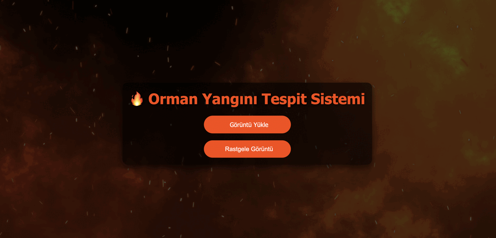

# CNN-Based-Fire-Detection-System
This project integrates a deep learning model into a web-based application to perform image processing tasks. The model was trained using Python in Google Colab, and the trained model is saved as model.pth. The Django framework is used to integrate the deep learning model with the backend, while the frontend was built using HTML and CSS. 

  

